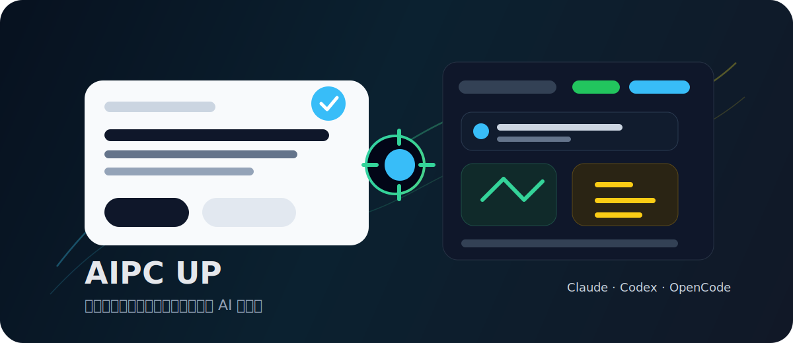

<p align="right">
  <strong>中文</strong> · <a href="./README_EN.md">English</a>
</p>

<p align="center">
  
</p>

<h1 align="center">AIPC UP</h1>

<p align="center">
  <strong>让普通电脑进化成AI电脑</strong>
</p>

<p align="center">
  <a href="https://github.com/learncodesmart/AIPC-UP/releases/latest">
    
  </a>
  <a href="https://huiai.io/product/">
    
  </a>
  
  
  
</p>

<p align="center">
  <a href="https://github.com/learncodesmart/AIPC-UP/releases/latest"><strong>立即下载</strong></a>
  ·
  <a href="https://huiai.io/product/">查看官网</a>
  ·
  <a href="https://github.com/learncodesmart/AIPC-UP/releases">历史版本</a>
</p>

---

## ✨ 产品定位

AIPC UP 不只是一个聊天窗口。它更像是运行在本地电脑上的 AI 工作台：你可以用自然语言描述任务，AI 可以读取项目、理解文件、操作浏览器和桌面应用，并把复杂任务拆成可执行步骤。

它适合希望把 AI 真正接入日常电脑工作的用户，尤其是开发、自动化、资料整理、网页操作和远程任务管理场景。

## 🚀 下载安装

| 项目 | 地址 |
| --- | --- |
| 最新安装包 | [下载 AIPC UP for Windows](https://github.com/learncodesmart/AIPC-UP/releases/latest) |
| 当前版本 | [AIPC UP v1.0.0](https://github.com/learncodesmart/AIPC-UP/releases/tag/v1.0.0) |
| 产品官网 | [huiai.io/product](https://huiai.io/product/) |

## 🧠 核心能力

| 能力 | 说明 |
| --- | --- |
| 🤖 多 AI 核心 | 连接 Claude、Codex、OpenCode 等 AI 核心，支持自定义模型地址和 API Key |
| 🗂 项目工作台 | 统一管理项目、文件、会话、计划和执行结果 |
| 💻 AI 编程 | 阅读项目、分析代码、修改文件、执行命令并检查结果 |
| 🌐 浏览器自动化 | 点击、输入、截图、收集信息、整理网页内容 |
| 🖥 桌面自动化 | 在授权后控制鼠标、键盘和本地窗口 |
| 🎙 语音任务 | 用文字或语音描述任务，支持中文/英文语音切换，让 AI 执行下一步 |
| 📱 远程访问 | 通过手机或另一台电脑查看任务进度、继续对话或停止任务 |
| 💬 多入口协作 | 支持接入微信、飞书、Telegram 等远程任务入口 |

## 🧩 使用场景

| 场景 | 你可以这样用 |
| --- | --- |
| AI 编程工作台 | 把本地项目交给 AI 阅读和分析，让 AI 帮你理解代码、定位问题、修改文件、生成计划、执行命令并检查结果 |
| 浏览器任务自动化 | 让 AI 打开网页、填写表单、收集信息、截图、整理页面内容，减少重复操作 |
| 桌面应用自动化 | 在你授权后，让 AI 操作本地桌面应用，完成需要鼠标、键盘和窗口配合的任务 |
| 远程管理任务 | 通过手机或另一台电脑访问 AIPC UP，查看任务进度、继续对话、接收结果或停止任务 |
| 多入口协作 | 从微信、飞书、Telegram 等工具发送任务给本地电脑上的 AI 工作台处理 |

## ⚡ 快速开始

```text
下载 Windows 安装包 → 安装 AIPC UP → 配置模型地址和 API Key → 选择 AI 核心 → 开始执行任务
```

1. 打开 [Releases](https://github.com/learncodesmart/AIPC-UP/releases/latest) 下载 Windows 安装包。
2. 安装并启动 AIPC UP。
3. 配置你的模型地址和 API Key。
4. 选择要使用的 AI 核心。
5. 用文字或语音描述任务，并可按场景切换中文/英文语音输入。
6. 需要浏览器、桌面或远程能力时，再按需授权。

## 🛡 安全说明

AIPC UP 可以执行真实的电脑操作，因此请谨慎授权并确认关键任务。

| 安全机制 | 说明 |
| --- | --- |
| 本地优先 | 项目、文件和运行环境优先保留在你的本地电脑 |
| 授权访问 | 浏览器、桌面和远程连接能力需要按需授权 |
| 过程可见 | 可查看任务状态、执行过程和操作记录 |
| 可控执行 | 任务可以暂停、继续或停止 |
| 谨慎操作 | 涉及账号、支付、删除、提交、发布等高风险动作时，请先确认再执行 |

## 📦 本仓库用途

本仓库用于发布 AIPC UP 的 Windows 安装包。

```text
AIPC UP Setup <version>.exe
```

当前已发布版本：

```text
v1.0.0
```

下载地址：[https://github.com/learncodesmart/AIPC-UP/releases](https://github.com/learncodesmart/AIPC-UP/releases)

## 🙏 致谢与开源生态

AIPC UP 的能力建设受益于以下 AI 工具生态与开源项目：

| 项目 | 说明 |
| --- | --- |
| [Claude Code](https://docs.anthropic.com/en/docs/claude-code) | Anthropic 官方 CLI |
| [Cursor CLI](https://docs.cursor.com/en/cli/overview) | Cursor 官方 CLI |
| [Codex](https://developers.openai.com/codex) | OpenAI Codex |
| [Gemini-CLI](https://geminicli.com/) | Google Gemini CLI |
| [React](https://react.dev/) | 用户界面库 |
| [Vite](https://vitejs.dev/) | 前端构建工具和开发服务器 |
| [Tailwind CSS](https://tailwindcss.com/) | Utility-first CSS 框架 |
| [CodeMirror](https://codemirror.net/) | 高级代码编辑器 |
| [TaskMaster AI](https://github.com/eyaltoledano/claude-task-master) | 可选的 AI 项目管理与任务规划能力 |

## 🔗 相关链接

- 产品官网：[https://huiai.io/product/](https://huiai.io/product/)
- GitHub Releases：[https://github.com/learncodesmart/AIPC-UP/releases](https://github.com/learncodesmart/AIPC-UP/releases)
