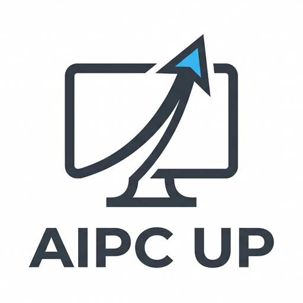

<p align="right">
  <a href="./README.md">中文</a> · <strong>English</strong>
</p>

<p align="center">
  
</p>

<p align="center">
  <strong>AIPC UP turns ordinary computers into AI computers</strong>
</p>

<p align="center">
  A <strong>local AI workbench</strong> for Windows<br>
  Read files, write code, control browser/desktop apps, and collaborate remotely with natural language
</p>

<p align="center">
  <a href="https://github.com/learncodesmart/AIPC-UP/releases/latest">
    
  </a>
  <a href="https://huiai.io/product/">
    
  </a>
  <a href="https://huiai.io/aipc-up/docs/">
    
  </a>
  
  
</p>

<p align="center">
  <a href="https://github.com/learncodesmart/AIPC-UP/releases/latest"><strong>📥 Download Now</strong></a>
  ·
  <a href="https://huiai.io/product/">🌐 Product Page</a>
  ·
  <a href="https://huiai.io/aipc-up/docs/">📖 Help Docs</a>
  ·
  <a href="https://github.com/learncodesmart/AIPC-UP/releases">📦 Release History</a>
</p>

<p align="center">
  
  
  
  
  
</p>

---

## Contents

- [What is AIPC UP](#-what-is-aipc-up)
- [Core Capabilities](#-core-capabilities)
- [What You Can Do](#-what-you-can-do)
- [First Conversation in 5 Minutes](#-first-conversation-in-5-minutes)
- [Three Key Terms](#-three-key-terms)
- [Safety & Local-First](#-safety--local-first)
- [Download](#-download)
- [Docs Navigation](#-docs-navigation)
- [Acknowledgments](#-acknowledgments)

---

## ✨ What is AIPC UP

**AIPC UP** is more than a chat window. It is a **local AI workbench** installed on Windows.

With your authorization, it can:

- Read files, organize materials, edit code, and run commands
- Operate browsers and desktop apps when needed
- Access the local workbench remotely from a phone or another computer
- Send and receive tasks through WeChat, Telegram, Feishu, and similar channels

Projects and tool execution stay on your machine by default. When a cloud model is used, conversation context required for the task is sent to the service you choose. See [Local-first](https://huiai.io/aipc-up/docs/privacy/local-first/).

---

## 🧠 Core Capabilities

<table>
  <tr>
    <td width="50%">
      <h3>🤖 Multiple AI Cores</h3>
      Connect <b>Claude</b>, <b>Codex</b>, <b>OpenCode</b>, and <b>Grok Build</b><br>
      Use HuiAI token or custom Base URL / API Key
    </td>
    <td width="50%">
      <h3>🗂 Project Workbench</h3>
      Manage projects, files, sessions, plans, and results<br>
      Keep working against real local folders
    </td>
  </tr>
  <tr>
    <td>
      <h3>💻 AI Coding</h3>
      Read projects, analyze code, edit files<br>
      Run commands and verify outcomes
    </td>
    <td>
      <h3>🌐 Browser Automation</h3>
      Click, type, screenshot, collect information<br>
      Process web pages with less repetitive work
    </td>
  </tr>
  <tr>
    <td>
      <h3>🖥 Desktop Automation</h3>
      Control mouse, keyboard, and local windows after authorization<br>
      Complete multi-app desktop workflows
    </td>
    <td>
      <h3>🎙 Voice Tasks</h3>
      Describe tasks by text or voice<br>
      Switch between Chinese and English voice input
    </td>
  </tr>
  <tr>
    <td>
      <h3>📱 Remote Access</h3>
      Check progress from a phone or another computer<br>
      Continue conversations, receive results, or stop tasks
    </td>
    <td>
      <h3>💬 Multi-channel Collaboration</h3>
      Connect WeChat, Feishu, Telegram, and more<br>
      Send tasks from messaging tools to your local workbench
    </td>
  </tr>
</table>

---

## 🎯 What You Can Do

| Need | Where to start |
| --- | --- |
| 📄 Summarize docs / organize materials | Open a folder and describe the goal and output format |
| 🧑‍💻 Read or edit code | Open a project, ask for read-only analysis first, then confirm edits |
| 🌍 Operate web pages or local apps | Get basic chat working, then enable browser/desktop automation |
| 📱 Continue tasks away from the PC | Enable remote access or messaging platforms as needed |

> Focus on a successful first conversation. Voice, automation, remote access, and messaging can wait.

---

## ⚡ First Conversation in 5 Minutes

Full guide:
[Install](https://huiai.io/aipc-up/docs/getting-started/install/) ·
[First setup](https://huiai.io/aipc-up/docs/getting-started/first-setup/)

### 1. Install and open the main window

1. Open the [latest release](https://github.com/learncodesmart/AIPC-UP/releases/latest)
2. Download `AIPC UP Setup <version>.exe` (not the Source code archive)
3. Install and launch AIPC UP from the Start menu or desktop
4. Create a **local account** on first launch (used later for remote login; **not** a HuiAI account)

### 2. Complete required configuration

Open **Settings → Required Configuration** and choose one path:

| Method | Best for | What to enter |
| --- | --- | --- |
| **HuiAI (recommended for new users)** | Existing HuiAI account | [HuiAI login token](https://huiai.io/token/) |
| **Custom** | Self-hosted / proxy / compatible providers | Base URL and API Key |

Save, then click **Check Connection** before continuing.

### 3. Open a safe test folder and try it

1. Choose a folder without passwords, customer data, or other sensitive content
2. Select **Claude**; if it is not running, pick any assistant marked “Running”
3. Create a session and send:

```text
Read this folder only. Summarize what is inside in three sentences. Do not modify any files.
```

4. If a permission prompt appears, confirm the path, then allow read-only access  
5. When the reply mentions real content from the folder, the basics are working

---

## 🔑 Three Key Terms

| Term | Meaning |
| --- | --- |
| **Project** | The local folder AI is currently allowed to work on |
| **Session** | A continuous conversation focused on one task |
| **Local account** | Username/password for remote workbench access, not a HuiAI account |

---

## 🛡 Safety & Local-First

AIPC UP can perform real computer operations. Authorize carefully and confirm critical actions.

| Mechanism | Description |
| --- | --- |
| 🏠 Local-first | Projects, files, and runtime stay on your machine first |
| ✅ Authorized access | Browser, desktop, and remote features require explicit permission |
| 👁 Visible process | Inspect task status, execution steps, and operation history |
| ⏯ Controllable | Pause, resume, or stop tasks |
| ⚠️ Careful ops | Confirm account, payment, delete, commit, and publish actions first |

More:
[Local-first](https://huiai.io/aipc-up/docs/privacy/local-first/) ·
[API keys & data flow](https://huiai.io/aipc-up/docs/privacy/api-keys/) ·
[Troubleshooting](https://huiai.io/aipc-up/docs/advanced/troubleshooting/)

---

## 🚀 Download

| Item | Link |
| --- | --- |
| 📥 Latest installer | [Download AIPC UP for Windows](https://github.com/learncodesmart/AIPC-UP/releases/latest) |
| 🏷 Current version | [AIPC UP v1.0.0](https://github.com/learncodesmart/AIPC-UP/releases/tag/v1.0.0) |
| 🌐 Product page | [huiai.io/product](https://huiai.io/product/) |
| 📖 Help docs | [huiai.io/aipc-up/docs](https://huiai.io/aipc-up/docs/) |

This repository publishes the Windows installer:

```text
AIPC UP Setup <version>.exe
```

---

## 📚 Docs Navigation

| Doc | Description |
| --- | --- |
| [Overview](https://huiai.io/aipc-up/docs/) | Product intro and 5-minute start |
| [Install](https://huiai.io/aipc-up/docs/getting-started/install/) | Download, install, local account, main window |
| [First setup](https://huiai.io/aipc-up/docs/getting-started/first-setup/) | HuiAI / custom config and first safe trial |
| [Projects & sessions](https://huiai.io/aipc-up/docs/workbench/projects-sessions/) | Core workbench concepts |
| [Browser automation](https://huiai.io/aipc-up/docs/automation/browser/) | Web page operations |
| [Desktop automation](https://huiai.io/aipc-up/docs/automation/desktop/) | Local app operations |
| [Remote access](https://huiai.io/aipc-up/docs/remote/access/) | Access the workbench from other devices |
| [Communication platforms](https://huiai.io/aipc-up/docs/remote/communication-platform/) | WeChat / Feishu / Telegram entry points |

---

## 🙏 Acknowledgments

Parts of AIPC UP are inspired by these open-source projects:

| Project | Description |
| --- | --- |
| [CloudCLI](https://github.com/siteboon/claudecodeui) | Web and mobile UI for AI coding agents |
| [cc switch cli](https://github.com/SaladDay/cc-switch-cli) | Unified CLI for Claude Code, Codex, Gemini CLI, and related tools |
| [avibe-os](https://github.com/avibe-bot/avibe) | Local-first Agent OS |
| [frp](https://github.com/fatedier/frp) | Fast reverse proxy and intranet tunneling |

---

## 🔗 Links

- Product page: https://huiai.io/product/
- Help docs: https://huiai.io/aipc-up/docs/
- HuiAI token: https://huiai.io/token/
- GitHub Releases: https://github.com/learncodesmart/AIPC-UP/releases
