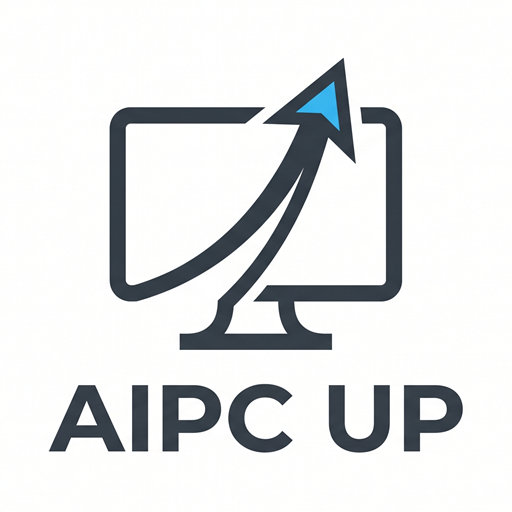

<p align="right">
  <a href="./README.md">中文</a> · <strong>English</strong>
</p>

<p align="center">
  
</p>

<p align="center">
  <strong>One Desktop. Your AI Agents, Actually Collaborating.</strong><br>
  <em>Turn Every PC into an AI PC</em>
</p>

<p align="center">
  A <strong>Local-First AI Agent Desktop Workspace</strong> for Windows.<br>
  Solo tasks, multi-agent teamwork, Screen Wall visual monitoring, desktop & browser automation, full-disk file management, and 24/7 remote scheduling.
</p>

<p align="center">
  <a href="https://github.com/learncodesmart/AIPC-UP/releases/latest">
    
  </a>
  <a href="https://huiai.io/product/">
    
  </a>
  <a href="https://huiai.io/aipc-up/docs/en/">
    
  </a>
  
  <a href="https://github.com/learncodesmart/AIPC-UP/releases">
    
  </a>
</p>

<p align="center">
  <a href="https://github.com/learncodesmart/AIPC-UP/releases/latest"><strong>📥 Download Now</strong></a>
  ·
  <a href="https://huiai.io/product/">🌐 Official Site</a>
  ·
  <a href="https://huiai.io/aipc-up/docs/en/">📖 Documentation</a>
  ·
  <a href="https://github.com/learncodesmart/AIPC-UP/releases">📦 Releases</a>
</p>

<p align="center">
  
  
  
  
  
  
</p>

---

## 📑 Table of Contents

- [✨ What is AIPC UP?](#-what-is-aipc-up)
- [🧠 Core Capabilities](#-core-capabilities)
- [🎯 Use Cases & Quick Lookup](#-use-cases--quick-lookup)
- [⚡ 5-Minute Quick Start](#-5-minute-quick-start)
- [🔑 Key Concepts at a Glance](#-key-concepts-at-a-glance)
- [🛡 Local-First Architecture & Safety](#-local-first-architecture--safety)
- [🚀 Download & Installation](#-download--installation)
- [📚 Documentation Directory](#-documentation-directory)
- [🙏 Acknowledgments](#-acknowledgments)
- [🔗 Related Links](#-related-links)

---

## ✨ What is AIPC UP?

**AIPC UP** is not just another conversational chat window. It is a **local-first AI Agent desktop workspace** deeply integrated into the Windows operating system.

It allows AI Agents to live directly on your PC. Beyond understanding natural language and real-time voice dictation, it operates your computer just like a skilled human assistant within the boundaries of your authorization:

- 👥 **Multi-Agent Teamwork**: Group multiple specialized AI Agents (architecture, coding, UI design, testing) to collaborate concurrently on complex projects.
- 🖥 **Full Desktop & Browser Automation**: Autonomously interact with desktop software, automate web scraping, form filling, and cross-application data pipelines.
- 📺 **Screen Wall Visual Monitoring**: Real-time visual dashboard capturing your primary desktop screen for monitoring automated routines and verifying remote assignments.
- 🗂 **Local File & Project Ownership**: Directly inspect project code, make modifications, run terminal commands, and view rich real-time previews.
- ⏰ **24/7 Always-On & Scheduled Tasks**: Schedule automated workflows to summarize daily reports, monitor metrics, or execute background routines around the clock.
- 📱 **Secure Remote Dispatch**: Command your desktop workspace on the go via mobile browsers, tablets, or social chat channels (WeChat, Feishu/Lark, Telegram).

All project files and runtime environments **remain strictly on your local machine by default**, ensuring maximum privacy and data sovereignty.

---

## 🧠 Core Capabilities

<table>
  <tr>
    <td width="50%">
      <h3>👥 Multi-Agent Teamwork</h3>
      Move beyond solo prompts. Orchestrate multi-agent teams with division of labor (e.g. Full-stack site redesign, App launches, Academic research, Story writing) working together in the same workspace.
    </td>
    <td width="50%">
      <h3>🤖 Built-in Assistant Center</h3>
      Out-of-the-box domain assistants: <b>Morph PPT Creator</b>, <b>Excel Calculator</b>, <b>Word Document Writer</b>, <b>UI/UX Pro Max</b>, <b>Academic Paper Assistant</b>, and more.
    </td>
  </tr>
  <tr>
    <td>
      <h3>⚡ Multi-Engine AI Cores & MCP</h3>
      Deeply integrates <b>Claude (Claude Code)</b>, <b>Codex</b>, <b>OpenCode</b>, and <b>Gemini CLI</b>; seamless integration with the <b>Model Context Protocol (MCP)</b> ecosystem.
    </td>
    <td>
      <h3>🖥 Desktop & Browser Automation</h3>
      Native mouse/keyboard simulation and window management for local software; intelligent browser automation for web browsing, data scraping, and automated form submission.
    </td>
  </tr>
  <tr>
    <td>
      <h3>📁 File Manager & Workspace (Git)</h3>
      Full-disk file manager and project workspace. Review Git diffs, semantic codebase navigation, and live preview panels for HTML, images, and documents.
    </td>
    <td>
      <h3>📺 Screen Wall & Live Monitoring</h3>
      Dedicated visual monitoring screen. Capture high-definition desktop snapshots in real time with 1s/3s/5s/10s polling and smart auto-suspend; visually inspect agent automation on the go.
    </td>
  </tr>
  <tr>
    <td>
      <h3>⏰ Scheduled Tasks & 24/7 Operations</h3>
      Standard Cron scheduling and automated background assistants. Wake up your PC to perform routine maintenance, generate analytics, and dispatch reports automatically.
    </td>
    <td>
      <h3>🎙 Real-Time Voice & Mini Window</h3>
      Instant speech-to-text with bilingual (Chinese/English) support; always-on-top Mini Floating Window for effortless access from anywhere on your desktop.
    </td>
  </tr>
  <tr>
    <td>
      <h3>📱 Secure Remote Access & Channels</h3>
      Built-in encrypted tunneling. Access your desktop workspace via WebUI on mobile/tablet, or dispatch tasks directly through <b>WeChat, Feishu, and Telegram</b>.
    </td>
    <td>
      <h3>🛡 Local-First & Data Sovereignty</h3>
      Your source code, private documents, and execution environments remain 100% on your local machine. Granular authorization safeguards personal and enterprise data assets.
    </td>
  </tr>
</table>

---

## 🎯 Use Cases & Quick Lookup

| Your Goal / Scenario | Recommended Feature | Documentation |
| --- | --- | --- |
| 🚀 **Install & Start First Chat** | Download Windows Installer → Configure Token → New Session | [Your First Chat](https://huiai.io/aipc-up/docs/en/getting-started/first-chat/) |
| 📊 **Create PPTs, Spreadsheets & Documents** | Assistant Center (Morph PPT / Excel / Word Creator) | [Assistant Center](https://huiai.io/aipc-up/docs/en/ai/assistants/) |
| 🧑‍💻 **Code Analysis & Automated Programming** | Workspace + Claude / Codex / OpenCode Agents | [Workspace and Git](https://huiai.io/aipc-up/docs/en/files/workspace/) |
| 🌐 **Web Scraping & Form Automation** | Browser Automation | [Browser Automation](https://huiai.io/aipc-up/docs/en/automation/browser/) |
| 🖱️ **Control Desktop Apps & Keyboard/Mouse** | Desktop Control (Windows native automation) | [Desktop Control](https://huiai.io/aipc-up/docs/en/automation/desktop/) |
| 📺 **Remote Desktop Monitoring & Live Audit** | Screen Wall (Visual Remote Desktop Screen) | [Screen Wall](https://huiai.io/aipc-up/docs/en/remote/screen-wall/) |
| 👥 **Complex Task Breakdown & Multi-Agent Teams** | Agent Teams | [Agent Teams](https://huiai.io/aipc-up/docs/en/team/overview/) |
| ⏰ **Routine Checks & Automated Reports** | Scheduled Tasks (Cron Workflows) | [Scheduled Tasks](https://huiai.io/aipc-up/docs/en/tasks/scheduled/) |
| 🎙 **Fast Voice Task Assignment** | Realtime Voice Input | [Realtime Voice Input](https://huiai.io/aipc-up/docs/en/chat/voice/) |
| 📱 **Remote Mobile Access & Chat Integration** | WebUI Remote Access / WeChat / Feishu / Telegram | [Remote Access (WebUI)](https://huiai.io/aipc-up/docs/en/remote/webui/) |

*For the comprehensive task guide, check out [Capabilities at a Glance](https://huiai.io/aipc-up/docs/en/getting-started/capabilities/).*

---

## ⚡ 5-Minute Quick Start

> 💡 Step-by-step documentation: [Install & Launch](https://huiai.io/aipc-up/docs/en/getting-started/install/) · [Required Setup](https://huiai.io/aipc-up/docs/en/getting-started/required-config/)

### Step 1: Download and Install AIPC UP
1. Visit the [GitHub Releases](https://github.com/learncodesmart/AIPC-UP/releases/latest) page and download `AIPC.UP.Setup.<version>.exe`.
2. Run the installer and launch AIPC UP.
3. On the first launch, create a **Local Account** (stored securely on your device for remote login verification).

### Step 2: Configure Models and Credentials
Navigate to **Settings → Required Setup**, and pick your preferred connection method:

| Connection Mode | Best For | What to Provide |
| :--- | :--- | :--- |
| **HuiAI (Recommended)** | Users with a HuiAI account | [HuiAI Access Token](https://huiai.io/token/) |
| **Custom / BYOK** | Custom relay / Direct provider APIs | Base URL, API Key, Model Name |

Click **Test Connection** to ensure connectivity.

### Step 3: Run Your First Local Task
1. Open or select a folder in the workspace panel (use a non-critical directory for testing).
2. Choose your preferred AI core or assistant (such as **Claude**).
3. Send the following prompt:

```text
Inspect this folder in read-only mode and summarize what files it contains in three sentences. Do not modify any files.
```

4. When the permission dialog appears, verify the directory path and click **Allow**.
5. Once the AI returns the folder summary, your local AI workspace is verified and ready for work!

---

## 🔑 Key Concepts at a Glance

| Concept | Explanation |
| :--- | :--- |
| **Project** | The local directory workspace where the AI agent is authorized to inspect and operate. |
| **Session** | An isolated conversational context dedicated to a specific goal, with full history and export capabilities. |
| **Screen Wall** | A dedicated visual dashboard capturing real-time desktop screen snapshots for remote inspection and automation audit. |
| **AI Core** | The underlying LLM engine driving the agent (Claude Code, Codex, OpenCode, Gemini CLI, etc.). |
| **Team** | A collaborative group composed of multiple specialized AI agents working together in the same workspace. |
| **Local Account** | Locally stored encrypted authentication credentials used for secure remote WebUI logins. |

---

## 🛡 Local-First Architecture & Safety

AIPC UP can perform real system operations. It adheres strictly to **local-first principles and the principle of least privilege**:

* 🏠 **Local-First Data Ownership**: Your codebases, documents, and environment files stay strictly on your local PC.
* 🔐 **Granular Permission Control**: File edits, shell command execution, network requests, and mouse/keyboard controls require explicit user confirmation.
* 👁 **Full Execution Transparency**: Tool calls, file diffs, and execution logs are displayed clearly in real time.
* ⏯ **Instant Intervention**: Pause, stop, or rollback ongoing agent operations at any moment.

*Learn more: [Data and Privacy](https://huiai.io/aipc-up/docs/en/security/privacy/) · [Tokens and Credentials](https://huiai.io/aipc-up/docs/en/security/tokens/)*

---

## 🚀 Download & Installation

| Channel | Link | Notes |
| :--- | :--- | :--- |
| 📥 **Latest Windows Installer** | [GitHub Releases Latest](https://github.com/learncodesmart/AIPC-UP/releases/latest) | Official `.exe` installer |
| 🏷 **Current Release** | [AIPC UP v1.0.1](https://github.com/learncodesmart/AIPC-UP/releases/tag/v1.0.1) | Includes latest multi-agent, Screen Wall & automation features |
| 🌐 **Official Product Page** | [huiai.io/product/](https://huiai.io/product/) | Explore product roadmap & features |
| 📖 **Online Documentation** | [huiai.io/aipc-up/docs/en/](https://huiai.io/aipc-up/docs/en/) | Complete user manuals & guides |

---

## 📚 Documentation Directory

The complete 10-section documentation suite is live:

```text
AIPC UP Documentation (https://huiai.io/aipc-up/docs/en/)
├── 🚀 Get Started: Overview · Install & Launch · Required Setup · First Chat · Capabilities
├── 🗺️ Interface & Shortcuts: Interface Tour · Shortcuts · Settings Map
├── 💬 Chat & Everyday: Realtime Voice · Floating Mini Window · Sessions · Input Tips · Permissions
├── 📁 Files & Projects: File Manager · Projects & Sessions · Workspace & Git · Preview Panel
├── ⚡ Automation: Desktop Assistant · Browser Automation · Desktop Control
├── 🤖 AI Cores & Tools: Assistant Center · Models & Providers · Skills · MCP Tools · Agents
├── 👥 Teams and Tasks: Agent Teams · Scheduled Tasks
├── 📱 Remote and Mobile: Remote Access (WebUI) · Mobile Access · Chat Channels · Screen Wall
├── 🎨 Personalize & Security: Appearance · Desktop Features · Tokens · Privacy
└── 💡 Maintenance & Support: FAQ · Troubleshooting · Updates · Contact & Support
```

---

## 🙏 Acknowledgments

AIPC UP is built upon the ingenuity and foundations of the open-source community. Special thanks to these exceptional projects and their contributors:

- [AionUi](https://github.com/aionui/aionui) - Excellent cross-platform AI desktop workspace foundation
- [CloudCLI](https://github.com/siteboon/claudecodeui) - Modern Web / Mobile UI for AI coding agents
- [cc switch cli](https://github.com/SaladDay/cc-switch-cli) - Multi-engine AI coding tool manager
- [avibe-os](https://github.com/avibe-bot/avibe) - Local-first agent operating architecture
- [frp](https://github.com/fatedier/frp) - Fast reverse proxy for secure tunneling

---

## 🔗 Related Links

- **Official Product Page**: [https://huiai.io/product/](https://huiai.io/product/)
- **Documentation Center**: [https://huiai.io/aipc-up/docs/en/](https://huiai.io/aipc-up/docs/en/)
- **HuiAI Token Center**: [https://huiai.io/token/](https://huiai.io/token/)
- **GitHub Repository**: [https://github.com/learncodesmart/AIPC-UP](https://github.com/learncodesmart/AIPC-UP)

---

<p align="center">
  <sub>Made with ❤️ by the AIPC UP & 慧AI Team</sub>
</p>
